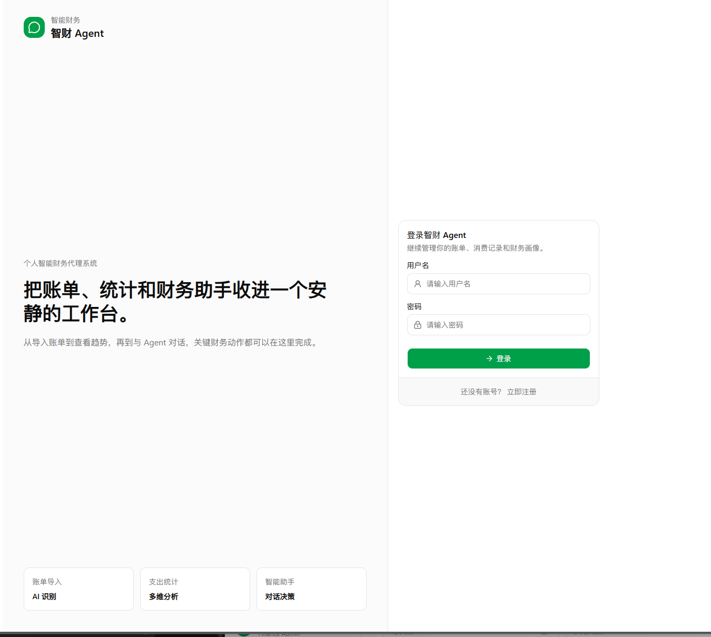
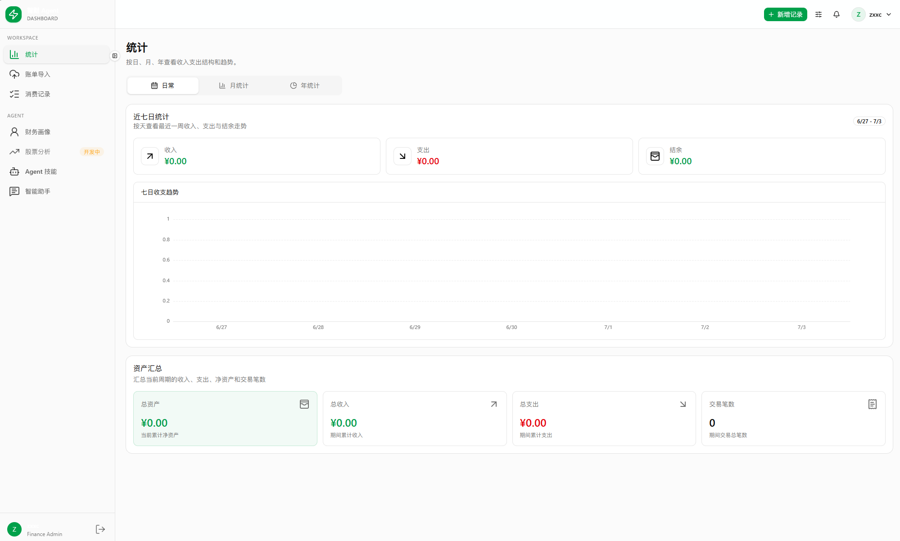
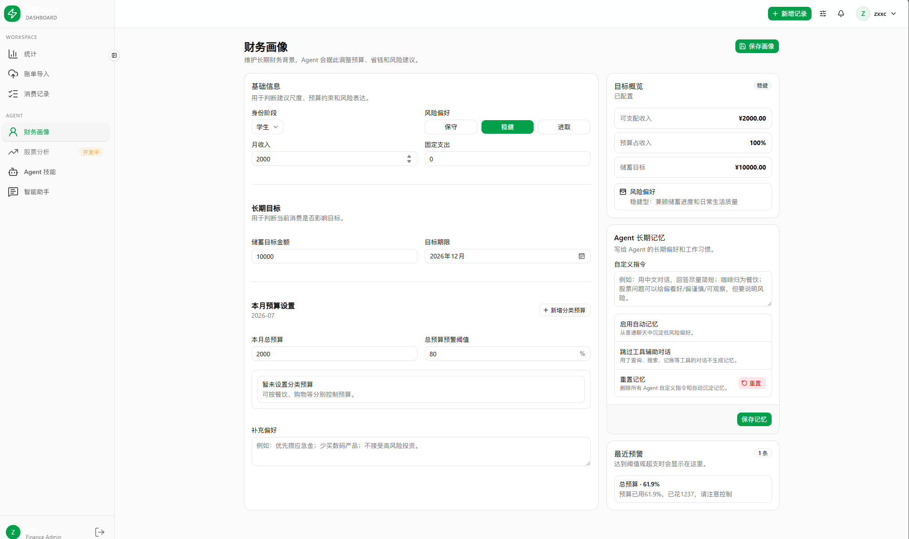
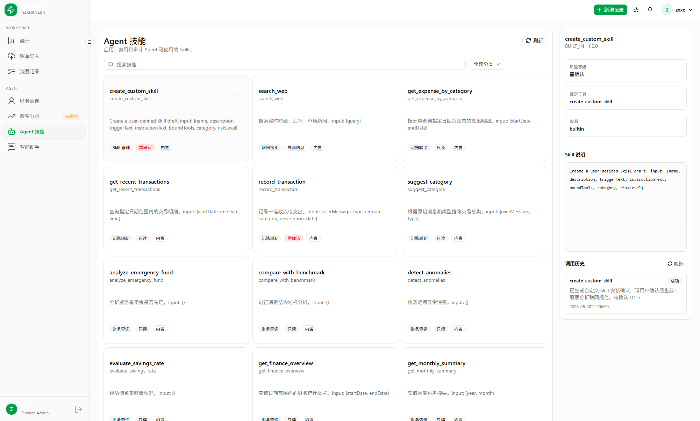
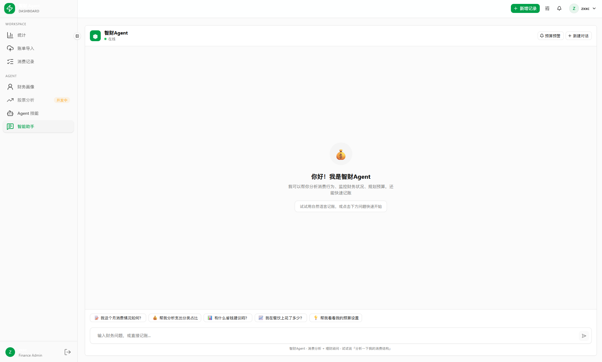

# 智财 Agent

智财 Agent 是一个个人智能财务代理系统，覆盖记账、账单导入、统计分析、财务画像、Agent 对话、长期记忆、反思、周期任务、待确认动作和 Skills 管理。

项目不是单纯的聊天机器人，而是把个人财务工作流逐步 Agent 化：

- 关键写操作需要确认
- 聊天链路可追踪
- 长期偏好可沉淀
- 稳定流程可以包装成 Skill
- 账单截图可以先识别候选结果，再人工确认入库

## 演示截图

### 登录页



### 统计页



### 财务画像



### Agent 技能



### 新对话



## 核心能力

- 注册、登录、JWT 鉴权和当前用户信息
- 收入/支出记录的新增、编辑、删除、分页查询和分类汇总
- 日、月、年统计图表，展示收支趋势、结余和分类占比
- 财务画像配置，维护收入、预算、储蓄目标、风险偏好和长期指令
- 预算预警和未读通知，支持查看、已读、批量已读
- 账单截图导入，通过多模态模型识别候选交易，确认后再写入正式消费记录
- AI 财务助手，支持普通对话、SSE 流式输出、ReAct 工具调用和历史记录
- Agent 长期记忆，支持用户偏好维护、自动沉淀、禁用和重置
- Agent 反思，针对对话结果生成可采纳记忆候选和技能改进建议
- Agent 周期任务，支持创建、启停、重试和运行记录查看
- Agent Skills，支持内置 Skill、外部说明型 Skill 和自定义 Skill
- 待确认动作，保证记账、预算设置、自定义 Skill 安装等关键写操作先审后执
- 侧边栏默认进入新对话页，登录后主页直接落到 `/chat`

## 技术栈

| 模块 | 技术 |
| --- | --- |
| 前端 | Vue 3, Vite 8, Pinia, Vue Router, Tailwind CSS 4, Reka UI, VueUse, ECharts 6 |
| 后端 | Java 17, Spring Boot 3.2.5, MyBatis-Plus, MySQL, JWT |
| AI | LangChain4j, DashScope Chat/Embedding, RAG, Tavily Search |
| 测试 | JUnit 5, Mockito, Spring Boot Test, H2 |

## 项目结构

```text
smart_finance_agent/
├── backend/                 # Spring Boot 后端
│   ├── src/main/java/       # Controller、Service、Entity、DTO、Mapper、Agent 逻辑
│   ├── src/main/resources/  # application.yml、schema.sql、data.sql
│   └── src/test/            # 后端测试
├── frontend/                # Vue 3 前端
│   ├── public/              # README 演示图和静态资源
│   ├── src/api/             # API 请求封装
│   ├── src/components/      # 业务组件与通用组件
│   ├── src/layouts/         # Admin 风格主布局
│   ├── src/router/          # 页面路由
│   └── src/views/           # 页面视图
├── env.example              # 本地配置示例
├── start-dev.ps1            # 一键启动前后端脚本
└── README.md
```

## 页面路由

| 路由 | 说明 |
| --- | --- |
| `/login` | 登录页 |
| `/register` | 注册页 |
| `/chat` | 新对话、历史对话和 ReAct 运行态 |
| `/statistics` | 收支统计 |
| `/transactions` | 消费记录 |
| `/profile` | 财务画像 |
| `/bill-import` | 账单导入 |
| `/skills` | Agent 技能 |
| `/agent-audit` | Agent 审计总览 |
| `/schedules` | 周期任务 |
| `/reflections` | Agent 反思 |
| `/pending-actions` | 待确认动作 |

## 后端接口

| 模块 | 接口前缀 | 说明 |
| --- | --- | --- |
| 认证 | `/api/auth` | 注册、登录、当前用户 |
| 交易 | `/api/transactions` | 收支记录和分类汇总 |
| 分类 | `/api/categories` | 消费分类管理 |
| 预算 | `/api/budgets` | 预算查询、保存、删除 |
| 通知 | `/api/alerts` | 预算提醒和已读标记 |
| 财务画像 | `/api/financial-profile` | 财务资料读取和保存 |
| 账单导入 | `/api/bills` | 截图上传、识别结果查询、确认入库 |
| 聊天 | `/api/chat` | 会话列表、历史记录、ReAct 流式对话 |
| Agent 运行 | `/api/agent-runs` | 按 traceId 查询运行步骤 |
| Agent 记忆 | `/api/agent-memories` | 长期指令、自动记忆、禁用、重置 |
| Agent Skills | `/api/agent-skills` | Skill 列表、安装、启停、删除、调用历史 |
| Agent 周期任务 | `/api/agent-schedules` | 创建、更新、启停、重试、删除、运行记录 |
| Agent 审计 | `/api/agent-audit` | 审计总览 |
| Agent 反思 | `/api/agent-reflections` | 反思结果确认/忽略 |
| Agent 上下文 | `/api/agent-context` | 上下文压缩、配置和使用情况 |
| 待确认动作 | `/api/pending-actions` | 确认或取消 AI 生成动作 |

## Agent 机制

### Chat / ReAct

聊天页通过 `POST /api/chat/react/stream` 进入流式 ReAct 执行链路。

基本流程是：

1. `ChatController` 接收请求
2. `ChatServiceImpl` 组织会话、历史和上下文
3. `ReActAgentService` 选择工具并生成步骤
4. `ToolRegistry` 负责实际可用工具
5. 运行结果、步骤和 traceId 写入后端记录

### 长期记忆

长期记忆分两类：

- 用户直接维护的长期指令，例如回答风格、偏好和固定约束
- 自动沉淀的低风险偏好，例如分类习惯和回答偏好

资产、密码、API Key、银行卡等敏感信息不会自动沉淀到 Agent 记忆中。

### 反思

反思模块会基于本次对话和运行结果生成：

- 可采纳的记忆候选
- 技能改进建议
- 风险提醒

当前实现只会自动处理低风险偏好，敏感财务事实不会自动写入记忆或技能。

### Skills

Skills 是 Agent 可读取的能力说明和工具绑定，不直接执行第三方脚本。当前支持：

- 内置 Skill：由后端安全工具生成
- 外部说明型 Skill：通过安装接口纳入管理
- 自定义 Skill：用户在聊天中描述稳定流程，确认后写入 Skill 列表

### 周期任务

周期任务支持：

- 创建任务
- 启用/停用
- 失败重试
- 查看运行记录

### 待确认动作

所有会改变用户数据的重要动作都要走待确认流程，例如：

- 记录交易
- 设置预算
- 安装对话生成的自定义 Skill

## 账单导入流程

1. 用户在前端上传微信、支付宝或银行卡流水截图。
2. 前端调用 `POST /api/bills/import`。
3. 后端保存原始图片，并通过 DashScope 多模态模型识别账单信息。
4. 系统返回账单类型、置信度、摘要和候选交易。
5. 用户在前端检查金额、分类、日期、描述等内容。
6. 用户确认后，系统才写入正式消费记录。

## 本地运行

### 环境要求

- JDK 17+
- Maven 3.8+
- MySQL 8.0+
- Node.js 18+
- npm 9+

### 数据库

```sql
CREATE DATABASE IF NOT EXISTS smart_finance
  DEFAULT CHARACTER SET utf8mb4
  COLLATE utf8mb4_unicode_ci;
```

后端启动时会读取 `backend/src/main/resources/schema.sql` 和 `backend/src/main/resources/data.sql` 初始化表结构和基础数据。

### 本地配置

复制 `env.example` 的内容到：

```text
backend/src/main/resources/application-local.yml
```

至少需要配置：

```yaml
spring:
  datasource:
    password: 你的数据库密码

jwt:
  secret: 你的 JWT 密钥

langchain4j:
  dashscope:
    api-key: 你的 DashScope API Key

search:
  api-key: 你的 Tavily API Key
```

`search.api-key` 可选；如果不使用联网搜索，可以留空。`application-local.yml` 不应提交到 Git。

### 一键启动

项目根目录提供开发脚本：

```powershell
.\start-dev.ps1
```

默认端口：

- 后端：`http://localhost:8080`
- 前端：`http://127.0.0.1:3000`

### 手动启动

后端：

```powershell
cd backend
mvn spring-boot:run
```

前端：

```powershell
cd frontend
npm install
npm run dev
```

## 验证命令

前端构建：

```powershell
cd frontend
npm run build
```

后端测试：

```powershell
cd backend
mvn test
```

后端编译：

```powershell
cd backend
mvn clean compile
```

## 开发备注

- 前端通过 Vite 代理把 `/api` 请求转发到后端。
- 聊天页、审计页、周期任务页和反思页都围绕同一套 Agent 运行链路工作。
- 账单导入识别结果只作为候选数据，必须经过用户确认才会写入正式交易表。
- 股票分析入口已在侧边栏预留，目前标注为“开发中”。
- 涉及实时行情、新闻、政策、汇率的问题需要联网检索后再回答。
- 外部 Skill 当前只读取说明和元数据；如果未来支持脚本型 Skill，需要单独设计沙箱、权限、超时和审计。
