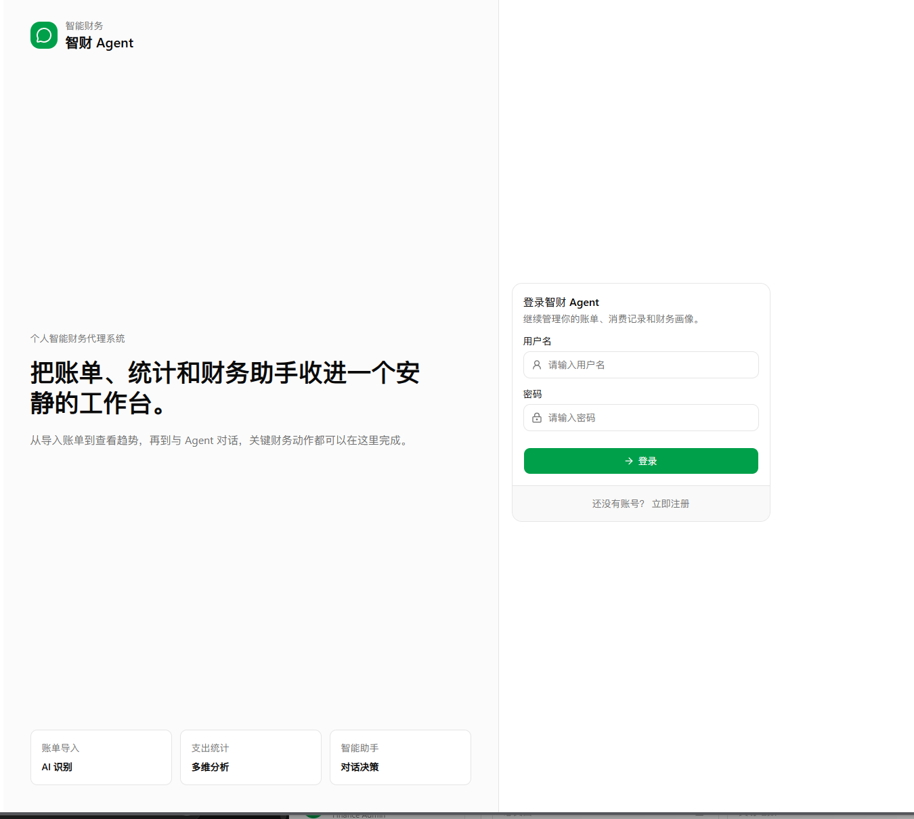
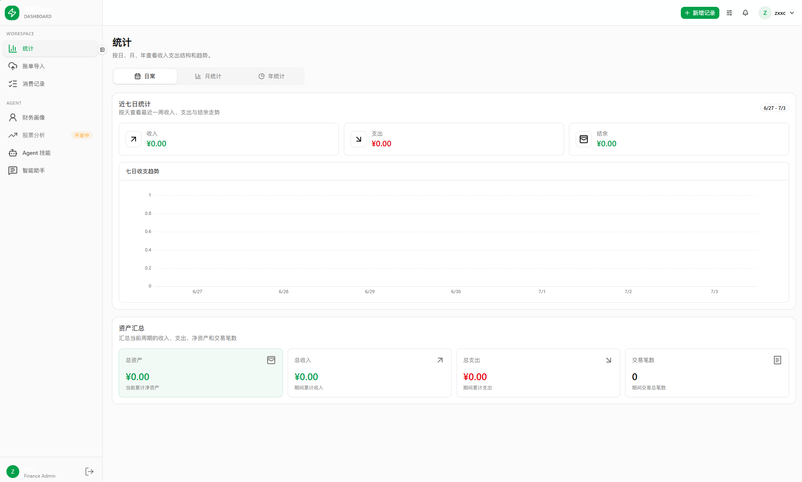
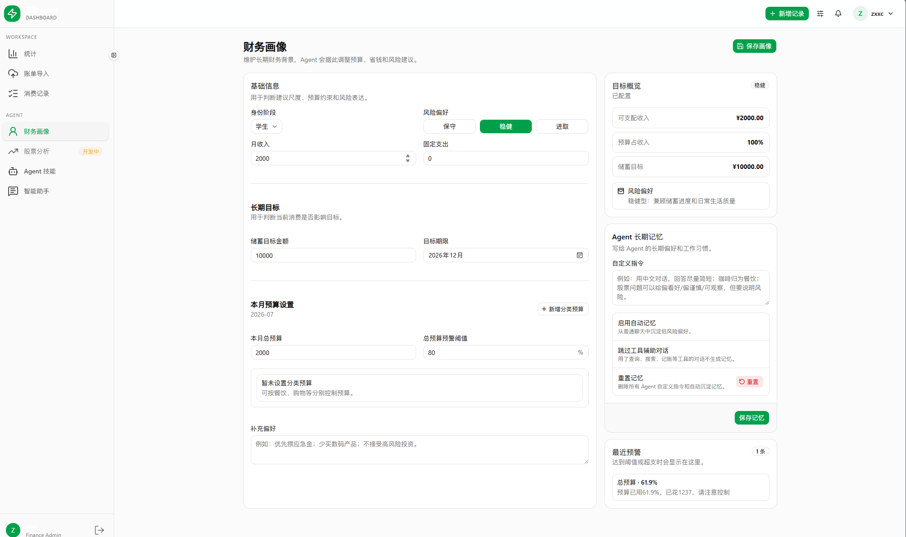
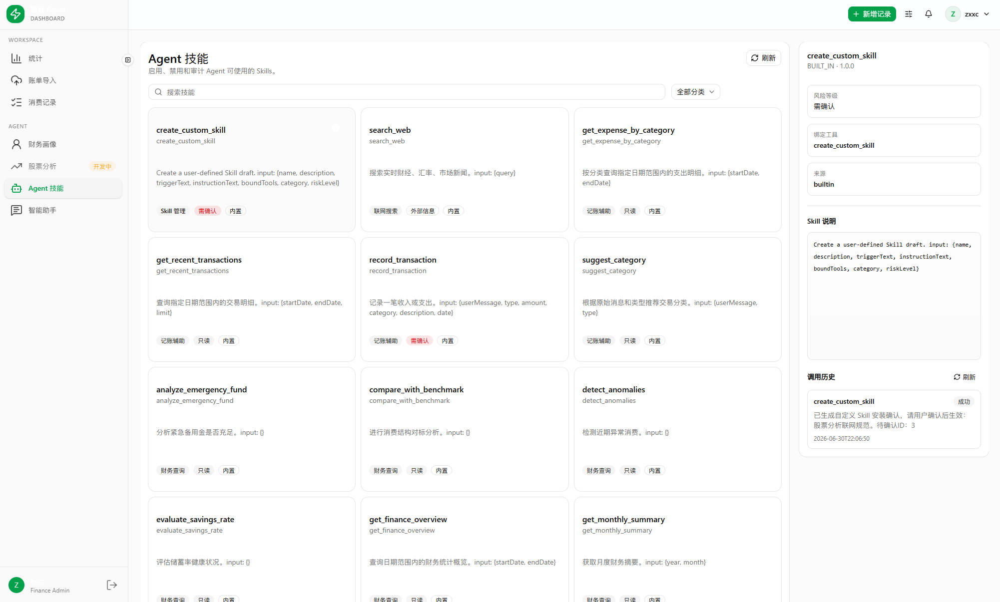
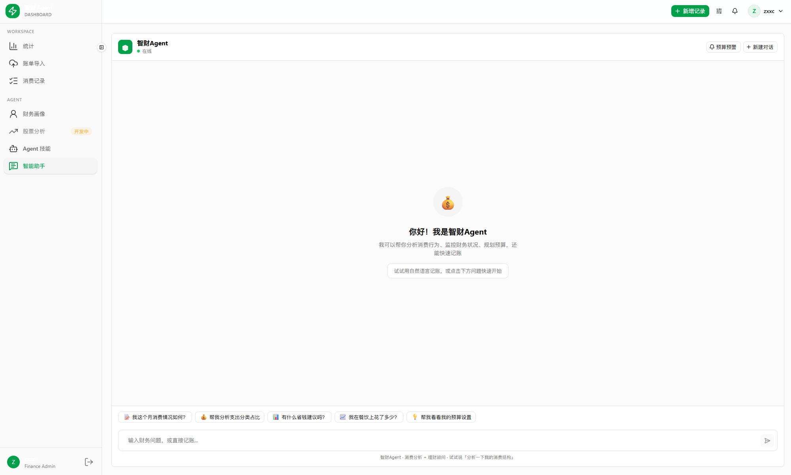

# 智财 Agent

**核心产品定位：** 智财 Agent：以个人财务为边界、以量化研究为决策引擎、以 Agent 为交互和编排核心的智能投资与财富管理系统。

智财 Agent 是一个个人智能财务代理系统，覆盖记账、账单导入、统计分析、财务画像、投资分析、量化研究与模拟运行，以及 Agent 对话、长期记忆、反思、周期任务、待确认动作和 Skills 管理。

项目不是单纯的聊天机器人，而是把个人财务工作流逐步 Agent 化：

- 关键写操作需要确认
- 聊天链路可追踪
- 长期偏好可沉淀
- 稳定流程可以包装成 Skill
- 账单截图可以先识别候选结果，再人工确认入库

## 数据采集范围

正常启动会更新证券目录，历史数据按实际使用范围在后台准备：持仓使用分析周期所需区间，打开市场详情产生有时限的需求，提交研究任务按冻结的资产池、研究区间和指标预热长度补数。保存资产池本身不触发全池下载。研究数据准备完成后才冻结行情快照并执行；等待中的任务不会挡住其他已就绪任务。

退出详情页后不再续期，默认 30 分钟后停止其独占采集；删除持仓、取消研究任务、停止模拟组合后，对应需求失效。多人需要同一产品时共享行情，已存数据保留。普通启动不会继续执行以前遗留的无有效需求全市场积压。

页面、持仓需求优先于研究任务，完整库按 `MARKET_DATA_FOREGROUND_QUOTA` 保留执行机会，默认每 8 个业务任务允许一个全库任务。数据中心分别显示当前任务和按需暂停的旧积压。暂停模拟组合只继续维护持仓和待处理事项；纯现金结算不要求下载整个资产池。

需要建设全市场研究库时，显式设置 `MARKET_DATA_FULL_LIBRARY_ENABLED=true`；用 `MARKET_DATA_FULL_LIBRARY_MARKETS` 和 `MARKET_DATA_FULL_LIBRARY_DATASETS` 选择市场及数据集。默认关闭全库模式，仅使用现有免费源。首次启动新版会执行 Flyway V9，升级时应同时更新后端和分析服务。

免费源缺失、限流和未发布记录仍可能使任务等待或失败；系统不会用填充值冒充真实数据，也不把采集进度等同于质量验证。当前因子引擎的数据依赖是价格、复权/累计收益、成交量与成交额，其他研究资料通过可选全库配置采集。

区间准备状态需要逐日覆盖证据，不能仅凭最后一条行情确认。基金模拟使用已确认区间内的真实净值和发布滞后规则，不要求当天尚未公布的净值。A 股日历仅用于匹配的市场及基金类别；美股、QDII、货币基金和分类未知基金的采集结果不会借用该日历宣称完整，缺少相应证据时仍需后续补齐。局部前复权回补会检查已有价格基准；基准变化时只有覆盖所有已存日期的替换序列才会写入。

## 演示截图

### 登录页



### 统计页



### 财务画像



### Agent 技能



### 新对话



## 核心能力

- 注册、登录、JWT 鉴权和当前用户信息
- 收入/支出记录的新增、编辑、删除、分页查询和分类汇总
- 日、月、年统计图表，展示收支趋势、结余和分类占比
- 财务画像配置，维护收入、预算、储蓄目标、风险偏好和长期指令
- 预算预警和未读通知，支持查看、已读、批量已读
- 账单截图导入，通过多模态模型识别候选交易，确认后再写入正式消费记录
- AI 财务助手，支持普通对话、SSE 流式输出、ReAct 工具调用和历史记录
- Agent 长期记忆，支持用户偏好维护、自动沉淀、禁用和重置
- Agent 反思，针对对话结果生成可采纳记忆候选和技能改进建议
- Agent 周期任务，支持创建、启停、重试和运行记录查看
- Agent Skills，支持内置 Skill、外部说明型 Skill 和自定义 Skill
- 待确认动作，保证记账、预算设置、自定义 Skill 安装等关键写操作先审后执
- 投资资产管理，支持股票、ETF 和场外基金的行情、历史数据及分析结果
- 指数关注列表，支持搜索、添加、排序和行情更新
- 量化工作台，支持资产池、因子组合、策略配置、训练、回测和结果比较
- 模拟交易组合，基于已验证回测持续生成信号、模拟成交并记录完整账本
- 侧边栏默认进入新对话页，登录后主页直接落到 `/chat`

## 技术栈

| 模块 | 技术 |
| --- | --- |
| 前端 | Vue 3, Vite 8, Pinia, Vue Router, Tailwind CSS 4, Reka UI, VueUse, ECharts 6 |
| 后端 | Java 17, Spring Boot 3.2.5, MyBatis-Plus, MySQL, JWT |
| 分析服务 | Python 3, FastAPI, Pandas, NumPy, SciPy, scikit-learn, XGBoost |
| AI | LangChain4j, DashScope Chat/Embedding, RAG, Tavily Search |
| 测试 | JUnit 5, Mockito, Spring Boot Test, H2 |

## 项目结构

```text
smart_finance_agent/
├── backend/                 # Spring Boot 后端
│   ├── src/main/java/       # Controller、Service、Entity、DTO、Mapper、Agent 逻辑
│   ├── src/main/resources/  # application.yml、db/migration
│   └── src/test/            # 后端测试
├── frontend/                # Vue 3 前端
│   ├── public/              # README 演示图和静态资源
│   ├── src/api/             # API 请求封装
│   ├── src/components/      # 业务组件与通用组件
│   ├── src/layouts/         # Admin 风格主布局
│   ├── src/router/          # 页面路由
│   └── src/views/           # 页面视图
├── analysis-service/        # 行情适配、投资分析和量化计算服务
│   ├── app/                 # FastAPI、数据提供器和量化引擎
│   └── tests/               # Python 测试
├── env.example              # 本地配置示例
└── README.md
```

## 页面路由

| 路由 | 说明 |
| --- | --- |
| `/login` | 登录页 |
| `/register` | 注册页 |
| `/chat` | 新对话、历史对话和 ReAct 运行态 |
| `/statistics` | 收支统计 |
| `/transactions` | 消费记录 |
| `/profile` | 财务画像 |
| `/bill-import` | 账单导入 |
| `/skills` | Agent 技能 |
| `/agent-audit` | Agent 审计总览 |
| `/schedules` | 周期任务 |
| `/reflections` | Agent 反思 |
| `/pending-actions` | 待确认动作 |
| `/stocks` | 投资资产列表、指数关注和资产导入 |
| `/stocks/:assetId` | 资产详情、历史行情与投资分析 |
| `/quant` | 量化策略列表和策略配置 |
| `/quant/universes` | 量化资产池 |
| `/quant/factors` | 因子组合与因子研究 |
| `/quant/tasks` | 训练、回测、因子任务及结果比较 |
| `/quant/deployments` | 模拟交易组合和运行账本 |

## 后端接口

| 模块 | 接口前缀 | 说明 |
| --- | --- | --- |
| 认证 | `/api/auth` | 注册、登录、当前用户 |
| 交易 | `/api/transactions` | 收支记录和分类汇总 |
| 分类 | `/api/categories` | 消费分类管理 |
| 预算 | `/api/budgets` | 预算查询、保存、删除 |
| 通知 | `/api/alerts` | 预算提醒和已读标记 |
| 财务画像 | `/api/financial-profile` | 财务资料读取和保存 |
| 账单导入 | `/api/bills` | 截图上传、识别结果查询、确认入库 |
| 聊天 | `/api/chat` | 会话列表、历史记录、ReAct 流式对话 |
| Agent 运行 | `/api/agent-runs` | 按 traceId 查询运行步骤 |
| Agent 记忆 | `/api/agent-memories` | 长期指令、自动记忆、禁用、重置 |
| Agent Skills | `/api/agent-skills` | Skill 列表、安装、启停、删除、调用历史 |
| Agent 周期任务 | `/api/agent-schedules` | 创建、更新、启停、重试、删除、运行记录 |
| Agent 审计 | `/api/agent-audit` | 审计总览 |
| Agent 反思 | `/api/agent-reflections` | 反思结果确认/忽略 |
| Agent 上下文 | `/api/agent-context` | 上下文压缩、配置和使用情况 |
| 待确认动作 | `/api/pending-actions` | 确认或取消 AI 生成动作 |
| 投资资产 | `/api/investment` | 资产、行情、历史数据和投资分析 |
| 指数关注 | `/api/investment/indexes` | 指数搜索、关注列表和排序 |
| 量化工作台 | `/api/quant/v2` | 资产池、因子、策略、任务、回测和模拟组合 |

## 量化工作台

量化工作台采用“研究 → 验证 → 模拟运行”的流程：

1. 从已有投资资产创建资产池。
2. 选择规则策略、多因子策略或机器学习策略，并保存不可变版本。
3. 使用共同有效交易日期训练或回测，查看收益、回撤、基准和交易明细。
4. 只有验证通过的回测可以创建模拟组合。
5. 模拟组合跟随本地已入库行情运行，记录信号、委托、成交、持仓和现金账本。

模拟结果只用于研究和验证。其完整性取决于行情采集、复权、基金净值公布和交易规则假设，不代表真实券商成交或未来收益。

## Agent 机制

### Chat / ReAct

聊天页通过 `POST /api/chat/react/stream` 进入流式 ReAct 执行链路。

基本流程是：

1. `ChatController` 接收请求
2. `ChatServiceImpl` 组织会话、历史和上下文
3. `ReActAgentService` 选择工具并生成步骤
4. `ToolRegistry` 负责实际可用工具
5. 运行结果、步骤和 traceId 写入后端记录

### 长期记忆

长期记忆分两类：

- 用户直接维护的长期指令，例如回答风格、偏好和固定约束
- 自动沉淀的低风险偏好，例如分类习惯和回答偏好

资产、密码、API Key、银行卡等敏感信息不会自动沉淀到 Agent 记忆中。

### 反思

反思模块会基于本次对话和运行结果生成：

- 可采纳的记忆候选
- 技能改进建议
- 风险提醒

当前实现只会自动处理低风险偏好，敏感财务事实不会自动写入记忆或技能。

### Skills

Skills 是 Agent 可读取的能力说明和工具绑定，不直接执行第三方脚本。当前支持：

- 内置 Skill：由后端安全工具生成
- 外部说明型 Skill：通过安装接口纳入管理
- 自定义 Skill：用户在聊天中描述稳定流程，确认后写入 Skill 列表

### 周期任务

周期任务支持：

- 创建任务
- 启用/停用
- 失败重试
- 查看运行记录

### 待确认动作

所有会改变用户数据的重要动作都要走待确认流程，例如：

- 记录交易
- 设置预算
- 安装对话生成的自定义 Skill

## 账单导入流程

1. 用户在前端上传微信、支付宝或银行卡流水截图。
2. 前端调用 `POST /api/bills/import`。
3. 后端保存原始图片，并通过 DashScope 多模态模型识别账单信息。
4. 系统返回账单类型、置信度、摘要和候选交易。
5. 用户在前端检查金额、分类、日期、描述等内容。
6. 用户确认后，系统才写入正式消费记录。

## 本地运行

### 环境要求

- JDK 17+
- Maven 3.8+
- MySQL 8.0+
- Node.js 18+
- npm 9+
- Python 3.11+

### 数据库

```sql
CREATE DATABASE smart_finance
  DEFAULT CHARACTER SET utf8mb4
  COLLATE utf8mb4_unicode_ci;
```

配置数据库账号密码后启动：

```bash
java -jar backend/target/smart-finance-agent-1.0.0-MVP.jar --spring.profiles.active=mysql
```

Flyway 自动执行 V1 创建当前完整结构，不创建测试用户。再次启动不会重复迁移。后续结构变更新增 `V2__描述.sql`、`V3__描述.sql`，不要修改已执行的迁移。

### 本地配置

复制 `env.example` 的内容到：

```text
backend/src/main/resources/application-local.yml
```

至少需要配置：

```yaml
spring:
  datasource:
    username: 你的数据库账号
    password: 你的数据库密码

jwt:
  secret: 你的 JWT 密钥

langchain4j:
  dashscope:
    api-key: 你的 DashScope API Key

search:
  api-key: 你的 Tavily API Key
```

`search.api-key` 可选；如果不使用联网搜索，可以留空。`application-local.yml` 不应提交到 Git。

### 手动启动

后端：

```powershell
cd backend
mvn spring-boot:run "-Dspring-boot.run.profiles=mysql"
```

分析服务：

```powershell
cd analysis-service
python -m venv .venv
.\.venv\Scripts\python.exe -m pip install -r requirements.txt
.\.venv\Scripts\python.exe -m uvicorn app.main:app --host 127.0.0.1 --port 8090
```

前端：

```powershell
cd frontend
npm install
npm run dev
```

## 验证命令

前端构建：

```powershell
cd frontend
npm run build
```

后端测试：

```powershell
cd backend
mvn test
```

后端编译：

```powershell
cd backend
mvn clean compile
```

分析服务测试：

```powershell
cd analysis-service
.\.venv\Scripts\python.exe -m pytest
```

## 开发备注

- 前端通过 Vite 代理把 `/api` 请求转发到后端。
- 聊天页、审计页、周期任务页和反思页都围绕同一套 Agent 运行链路工作。
- 账单导入识别结果只作为候选数据，必须经过用户确认才会写入正式交易表。
- 投资分析和量化工作台依赖分析服务；使用一键启动脚本时会同时启动三个服务。
- 涉及实时行情、新闻、政策、汇率的问题需要联网检索后再回答。
- 外部 Skill 当前只读取说明和元数据；如果未来支持脚本型 Skill，需要单独设计沙箱、权限、超时和审计。
